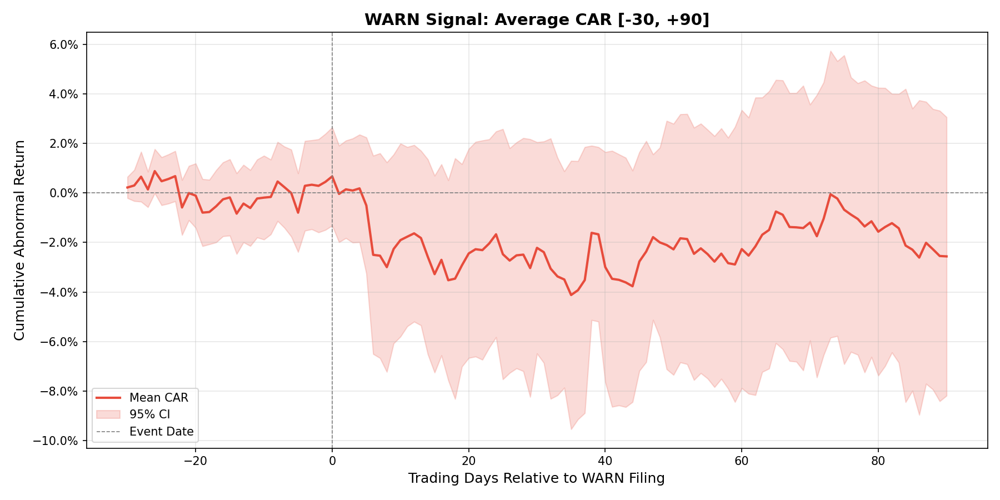
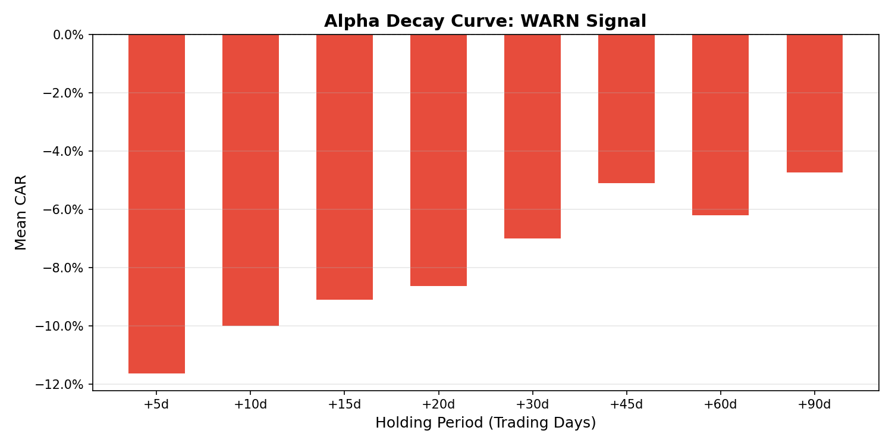
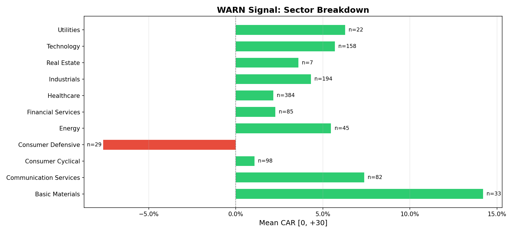
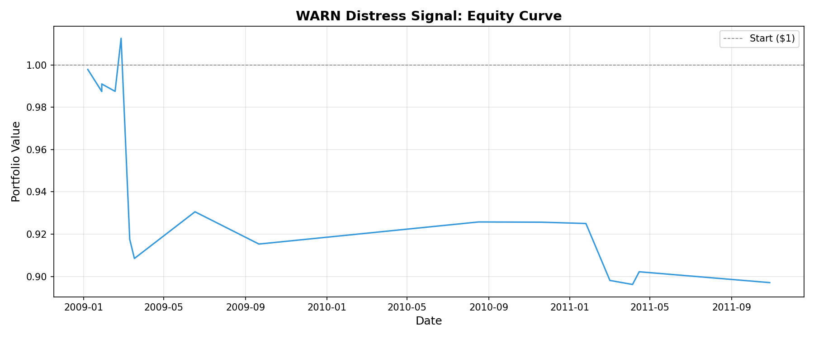

# WARNSignal: Research Report

## Executive Summary

- **Events Analyzed**: 251
- **Mean CAR [0, +30]**: -2.66%
- **Median CAR [0, +30]**: 1.87%
- **t-statistic**: -1.1406
- **p-value**: 0.2551
- **% Negative**: 46.61%

## Backtest Results

- **Sharpe Ratio**: 0.2532
- **Max Drawdown**: 53.49%
- **Win Rate**: 41.53%
- **Total Return**: 0.00%
- **Number of Trades**: 118
- **Avg Return/Trade**: N/A

## CAR Analysis

### CAR [-30, 0]
- Mean: 0.12% (t=0.1236, p=0.9017)
- 95% CI: [-1.74%, 1.97%]

### CAR [0, +30]
- Mean: -2.66% (t=-1.1406, p=0.2551)
- 95% CI: [-7.24%, 1.91%]

### CAR [0, +60]
- Mean: -2.77% (t=-0.8963, p=0.3710)
- 95% CI: [-8.82%, 3.29%]

### CAR [0, +90]
- Mean: -3.06% (t=-1.0200, p=0.3087)
- 95% CI: [-8.95%, 2.82%]

## Alpha Decay

## Sector Breakdown

## Equity Curve

## Where It Breaks

The signal does **not** work uniformly. Honest reporting of failure modes:

**Sectors where signal is weak or inverted** (positive CAR = market didn't punish the layoff):

- Technology: Mean CAR = 6.30% (n=86)
- Financial Services: Mean CAR = 2.71% (n=7)
- Consumer Defensive: Mean CAR = 1.44% (n=6)

**Sectors where signal is strongest** (negative CAR, p < 0.05):

- Healthcare: Mean CAR = -10.77% (n=67)

**By market cap**:

- large: Mean CAR = 0.31%, p=0.7711 (NOT significant, n=102)
- mega: Mean CAR = 3.96%, p=0.0264 (significant, n=39)
- micro: Mean CAR = -23.18%, p=0.0370 (significant, n=26)
- mid: Mean CAR = 3.09%, p=0.5511 (NOT significant, n=39)
- small: Mean CAR = -14.13%, p=0.2058 (NOT significant, n=8)

Expected: signal weakens for large-caps where analyst coverage prices in layoffs quickly.

## Limitations

- **Entity resolution**: Match confidence drops below 80% for private subsidiaries. Low-confidence matches (< 85 score) are excluded from the backtest.
- **State coverage**: Only 5 states scraped — filings in other states are missed entirely.
- **Survivorship**: Delisted tickers are included but price data terminates at delisting, potentially understating full decline.
- **Transaction costs**: 10 bps/leg assumed. Signal may not survive for micro-caps with wide spreads.
- **Filing date lag**: Some state websites publish filings days after the actual filing date, introducing potential look-ahead.
- **Sample size**: Minimum 50 events recommended for statistical validity. Current sample (251 events) meets this threshold.

---
*Generated by WARNSignal — research signal, not investment advice*
